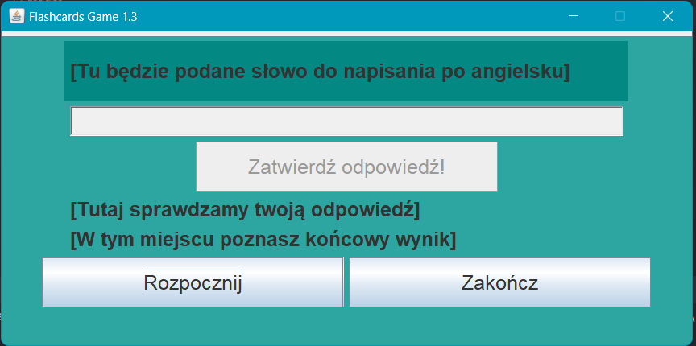
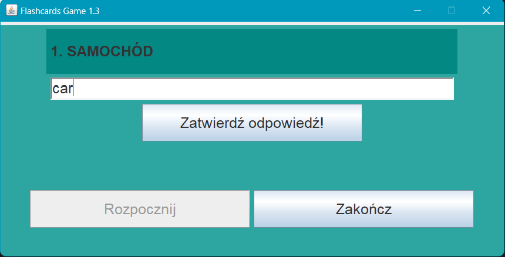
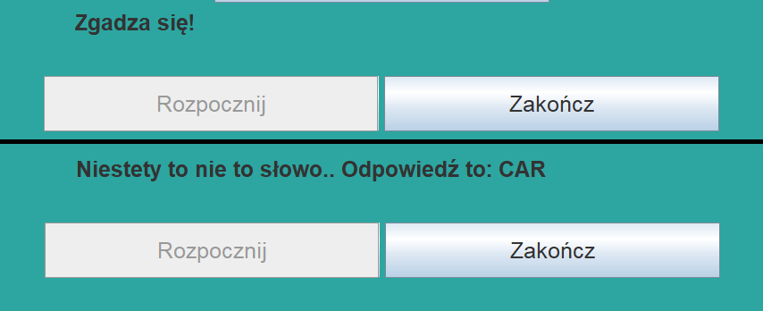
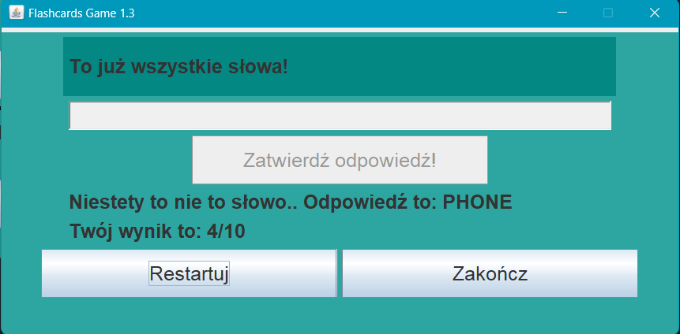
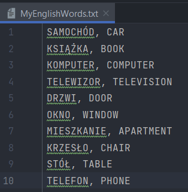
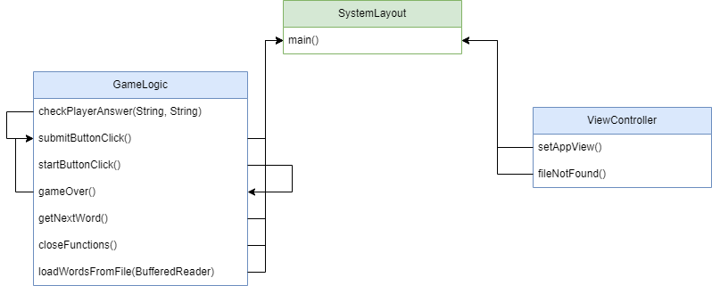

# English Flashcards

**Description**

I would like to show you my java swing application for learning English words. I'm very pround of this app since it will help me during my academic year.

**Prerequisites**
-   Java Development Kit (JDK) 17 or later

**Configuration** 

 1. Clone the repository to your local machine
    git clone https://github.com/FalanaJ/EnglishFlashcardsGame.git
    
2. Run the application

**Usage**

As you can see, the application is in sea colors, so calm and pleasant to the eye, the first photo shows how everything is described to a new user so that he knows what is going on.

The next ones show the operation of the program itself - we enter the word in English below its Polish equivalent and press the "Zatwierdź odpowiedź" button OR press the ENTER button, which I am very proud of because it makes it much easier for someone who wants to go through it quickly.

Below it will be displayed whether we are right or wrong, if not, the correct form will be displayed.  There are buttons to exit the program and to reset after completing the approach.  Interestingly, the program will react when we do not put the file with our words into the appropriate folder and the system does not find it.  It won't let us just start approaching.

To add your words you have to modify MyEnglishWords.txt file and write words like on the photo below.

This is a diagram that shows the arrangement of classes and methods in the application

## Author
### Jacob Falana
### jakub.falana@op.pl

## License
This project is released under the MIT license.

## Contact
If you have any questions or run into problems, please contact me at the email address listed above.
